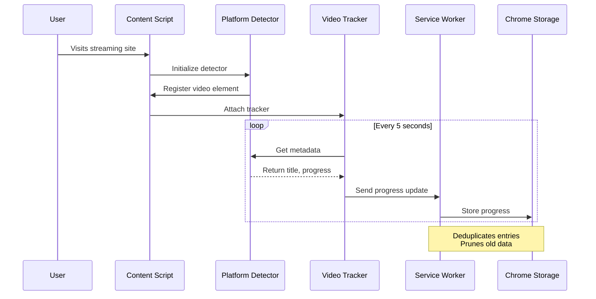
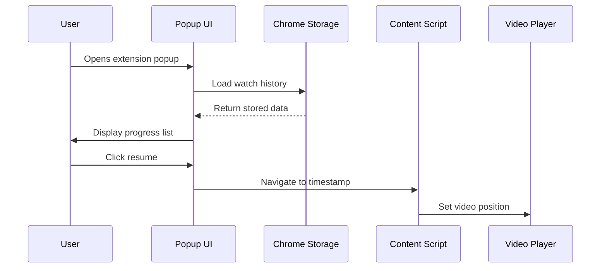
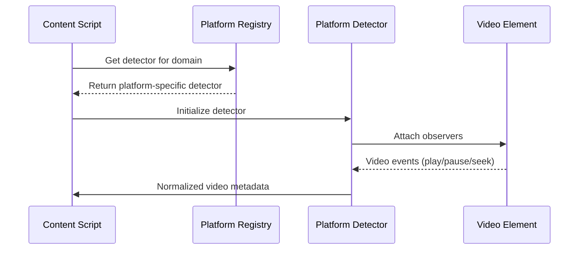

# ReWatch Architecture

## Overview

ReWatch is a Chrome extension born out of a personal need. As someone who watches content across multiple streaming platforms, I often found myself losing track of where I left off on different shows and movies. I searched for a complete solution but never found one that worked across all major platforms, respected privacy, and was easy to use. So, I built ReWatch to solve my own problem and decided to share it freely with others who might find it useful.

## Component Architecture

```text
ReWatch/
├─ manifest.json          # Chrome extension manifest (MV3)
├─ background.js          # Service worker: storage orchestration & deduplication
├─ content/               # Modular content scripts (core helpers, detectors, tracker)
│  ├─ core/               # Shared namespace, logging, DOM helpers, registry
│  ├─ platform-detectors/ # One detector per streaming service
│  └─ video-tracker/      # Runtime that wires detectors to storage messaging
├─ popup.html             # Popup layout
├─ popup.css              # Popup styles
├─ popup.js              # Popup logic (filters, export, open/delete actions)
├─ icons/                # Extension icons (16/32/48/128 px)
├─ docs/                 # Project documentation and marketing copy
├─ tests__/            # Jest-based automated tests (background worker)
├─ package.json          # Node tooling configuration (Jest scripts, deps)
├─ .gitignore            # Source-control hygiene rules
```

## Sequence Diagrams

### 1. Video Progress Tracking Flow



### 2. Resume Flow



### 3. Cross-Platform Detection



## Component Roles

- **Content Scripts**: Loaded on supported streaming platforms, detect and track HTML5 `<video>` playback, extract metadata, and send updates.
- **Background Service Worker**: Centralizes all progress, deduplicates history, cleans up completed items, manages persistent storage.
- **Popup UI**: Surfaces tracked history, allows resuming/opening/deleting entries, supports filtering and exporting data.
- **Platform Detectors**: Service-specific logic for Netflix, Disney+, HBO Max, etc.
- **Local Storage**: All data stored in Chrome Storage API, nothing leaves the user's device.

## Key Features

- Privacy-focused with all data stored locally
- Efficient updates with 5-second intervals
- Smart deduplication of series episodes
- Clean separation between platform-specific and core logic
- Export functionality for data backup
- Automatic cleanup of old completed items

The architecture ensures privacy by keeping all data local while providing a seamless experience across different streaming platforms.